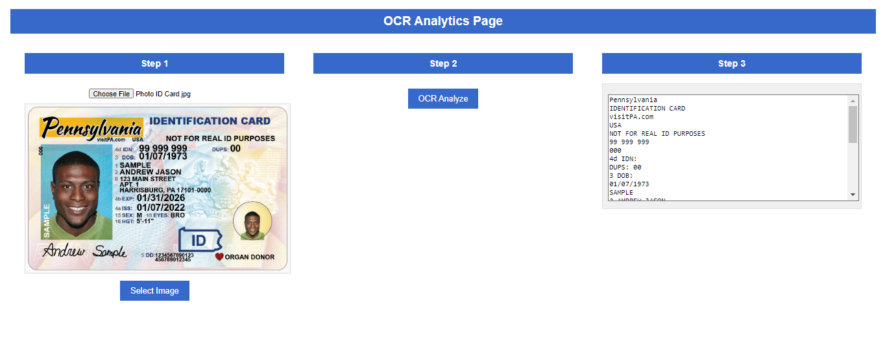

# OCR Analytics Project Documentation

This documentation covers the entire OCR Analytics project, from setting up the frontend to using Azure AI for Optical Character Recognition (OCR) and displaying the results. 

## Project Overview

This project demonstrates how to integrate Azure's Computer Vision API into a React application for extracting text from uploaded images using Optical Character Recognition (OCR). The extracted text is then displayed in a structured format on the frontend.

---

## 1. Project Setup Instructions

### Step 1: Install Node.js and Create a React App

1. Install [Node.js](https://nodejs.org/en/) if you don't have it already.
2. Run the following commands to create a new React app and navigate into the project directory:
   - `npx create-react-app ocr-analytics`
   - `cd ocr-analytics`

### Step 2: Install Required Dependencies

Install the following libraries:
- **Axios**: For making API requests.
   - Command: `npm install axios`

### Step 3: Set Up Azure Computer Vision API

1. Log in to the [Azure Portal](https://portal.azure.com/).
2. Click **Create a resource** and search for **Computer Vision**.
3. Set up a new Computer Vision resource.
4. After the resource is created, go to **Keys and Endpoint** to retrieve your **API key** and **Endpoint**.
5. Replace the placeholders in the app with your actual Azure **Endpoint** and **API key**.

---

## 2. Running the Project

### Step 1: Start the React Development Server

1. After setting up the project, you can run the app using the following command:
   - `npm start`
   
   This will launch the app in your default web browser. If it doesn't open automatically, visit `http://localhost:3000/` in your browser.

### Step 2: Use the Application

1. Upload an image for OCR analysis (such as an ID card).
2. Click on the "OCR Analyze" button to send the image to the Azure API.
3. The extracted text will appear in the output box.

---

## 3. Extracted Text from OCR

Below is the result of the OCR process after analyzing the uploaded image:

### Uploaded Image:


### Extracted Text:

```
Pennsylvania
IDENTIFICATION CARD
visitPA.com
USA
NOT FOR REAL ID PURPOSES
99 999 999
000
4d IDN:
DUPS: 00
3 DOB:
01/07/1973
SAMPLE
2 ANDREW JASON
8 123 MAIN STREET
APT. 1
HARRISBURG, PA 17101-0000
4b EXP: 01/31/2026
4a ISS:
01/07/2022
15 SEX: M 18 EYES: BRO
ABERTY
16 HGT: 5'-11"
Andrew Sample
ID
SAMPLE
5 DD:1234567890123
456789012345
ORGAN DONOR
```

---

## Conclusion

This project demonstrates how to integrate Azure AI's Computer Vision API with a React frontend to perform OCR on images and display the extracted text. The uploaded image is displayed on the frontend, and the extracted text is shown in a text box after analysis.

